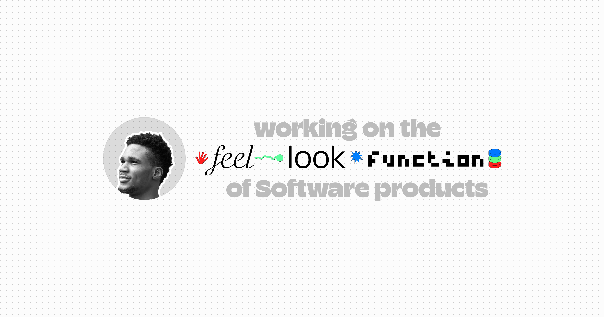

## Hey there! I’m Oyindamola [dami]. I design and build products across platforms, working on how they work, how they're used, and how they feel. I collaborate with thinkers and builders to turn ideas into reality.

Primarily using  and  or  programming languages, I build end-to-end products and systems. Combining  with ,  and , I create fast, responsive, scalable, and interactive web interfaces.

For mobile development,  and  help me deliver cross-platform applications with consistent performance and feel.

For desktop applications, I use  to build cross-platform experiences that share the same performance and interaction principles.

On the backend, I design scalable APIs with , , and . I use  with  for larger, structured applications that require real-time data and more complex features, while  serves as a flexible, document-based option for smaller applications.

I deploy through  and , and keep everything version-controlled with  and . **Creating systems that are reliable, maintainable, and ready for growth.**

**_Tools change. Systems evolve. I adapt._**

`Let's discuss!` [View my Works](https://d0y.in) \ [Send a DM](https://x.com/byoyindamola) \ [Send an email](mailto:oyindosumu4@gmail.com)
